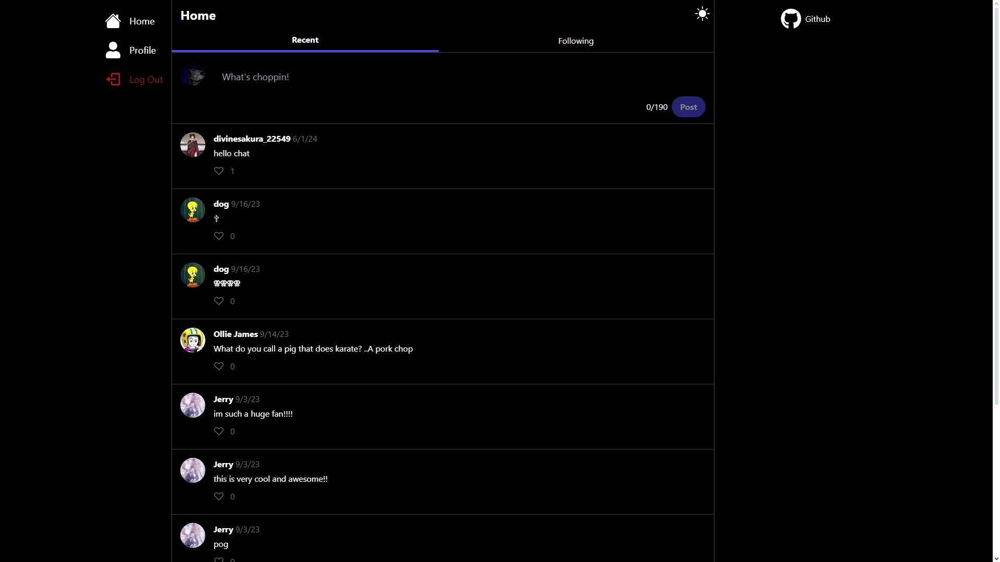

# BreakSphere

BreakSphere is a Twitter-like platform designed specifically for musicians by musicians. It provides a space for musicians to connect, share their work, and collaborate with others in the industry.

## Technologies Used

- React: A JavaScript library for building user interfaces.
- Next.js: Next.js is a React framework that enables server-side rendering and provides an excellent developer experience.
- NextAuth.js: NextAuth.js is an authentication library for Next.js applications, offering various authentication strategies out of the box.
- Prisma: Prisma is an ORM (Object-Relational Mapping) tool that simplifies database access and management.
- Tailwind CSS: Tailwind CSS is a utility-first CSS framework that allows you to rapidly build custom user interfaces.
- tRPC: tRPC is a TypeScript-first framework for building efficient and type-safe APIs.

## Deployment and Authentication

BreakSphere is deployed on Vercel and can be accessed at [breaksphere.vercel.app](https://breaksphere.vercel.app/). 

To sign in to BreakSphere, you have multiple authentication options available, including:

- Discord
- Google
- GitHub

Choose the authentication method that suits you best and start exploring BreakSphere's vibrant community of musicians!

Please note that additional authentication options may be added in the future based on user feedback and requirements.

## Organizing with Trello

In developing BreakSphere, Trello was a vital tool. My Trello board, accessible [here](https://trello.com/b/Mt7Uddx4/breaksphere), is divided into sections: 'Bugs', 'To Do', 'Maybe', 'Doing', and 'Done'. This categorization streamlined my workflow, enabling efficient task tracking and prioritization.

# Media

